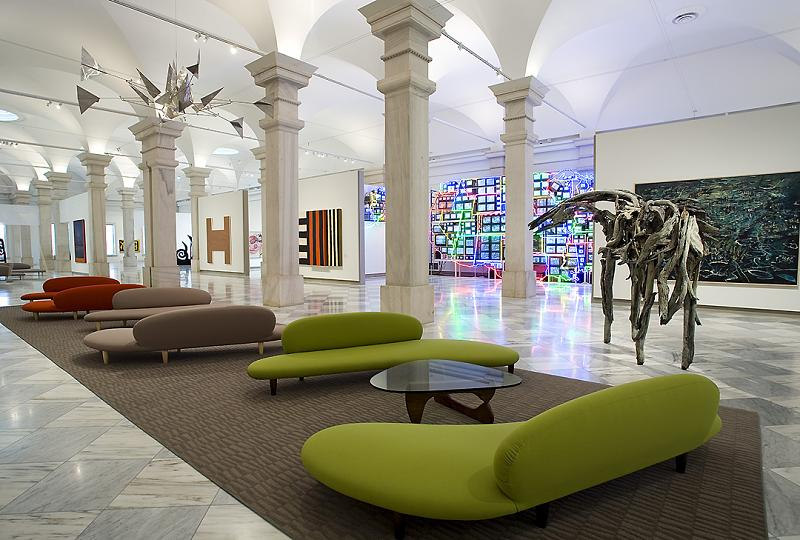
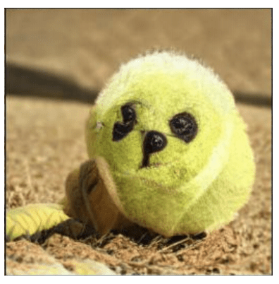

# Building a 17-Megapixel AI Artist

_March 6, 2022_

## Inspiration

Living in the Washington, DC area has its perks. One of my favorites is the Smithsonian. Many people know of the Museums of Natural History, Air and Space, and American History, but fewer tend to visit the wonderful art museums offered by the Smithsonian. During a visit to one, being the nerd I am, I started thinking about what it'd take to build an AI artist. As I strolled
through the seemingly-endless halls of art, the idea for my next hobby project came to fruition.


*Smithsonian American Art Museum, Washington, DC*

## What Kind of Art?

The answer to this question is more important than it would seem. Theoretically, an AI practitioner can train a model on all sorts of images.
An AI artist could learn from any kind of art. In practice, however, the type of data used matters.

One possibility was to create human portraits. AI researchers have spent a lot of time working on human face generation, and many of the resulting
images are [quite convincing](https://generated.photos/face-generator/new), though they're all fake. The challenging thing about generating realistic-looking
human faces is that we're keenly aware of the tiniest defects in faces. The human brain contains a region called the [fusiform face area](https://en.wikipedia.org/wiki/Fusiform_face_area), which is highly specialized at facial recognition. Because of this, human portraits are perhaps the hardest kind of art for an AI to do well.
Any mistake will stick out like a sore thumb – and make mistakes AI does.


*An AI mixes up a puppy and a tennis ball*

It's well known that generative Deep Learning models often struggle to create logical representations of the world. For instance, AI models will
create people with dichromatic eyes (there are real dichromatic people, but AI does it much more frequently) and even such monstrocities as tennis ball puppies. Granted, some human artists also struggle with this sort of thing.
Given that AI is prone to creating things that don't make sense, is there a kind of art with no logical bearing on the real world?


*Wassily Kandinsky, Composition VIII*

While beautiful, abstract art typically exists independently from reality. This makes it ideal for Deep Learning art. Whatever color swaps, counting errors, distortions, etc. the AI artist makes are unlikely to be prominent.

## Dataset

After deciding on abstract art, I needed to find a dataset. Most Deep Learning
models for Computer Vision produce images that aren't much larger than 512x512 pixel resolution, which is far too tiny to hang on the wall.
Also, most Deep Learning research stays far away from anything as fun as abstract art generation. As a result, there aren't
a lot of abstract art datasets out there, especially not ones good enough to produce huge, 17-megapixel images for making
wall-worthy canvases. So I created my own, which I've included a link to in the "Create Your Own AI Artist" section. After scouring the Internet for a few weeks,
I compiled a dataset of 1,192 high-resolution abstract art images. I then ran a preprocessing step to resize them all to the desired 4096x4096.

The reader may be wondering: "How could a relatively tiny dataset of under 1200 images possibly be used to produce anything worthwhile?" Good question. Typical
Computer Vision tasks that aren't toy problems require huge datasets of many thousands of images, just the kind I wasn't about to procure by
hand. Imagine the mind-numbing tedium. Instead, I applied a variety of data augmentation techniques randomly to each batch of images during training time.
These augmentations include introducing color jitter, flips, and rotations. Data augmentation is yet another advantage to selecting abstract art; it wouldn't be desirable to show the
model upside down human portraits, for instance, but with abstract art it doesn't really matter, as nothing makes sense anyway. It's difficult to say for certain, but continuously
showing the model somewhat unique images from the augmented dataset may have had a similar effect on performance as increasing the dataset size an order of
magnitude would have.

## Training

Now that I had a dataset, I had to finally address the question I was putting off for so long: how on God's green earth do I train a 17-megapixel AI artist?
I wasn't aware of any AI research producing images anywhere close to 4096x4096 resolution, however I came across a paper that produced 1024x1024 images
by starting at smaller resolutions and periodically adding neural network layers to scale up. This technique is known as PGAN, or [Progressive Growing of GANs](https://arxiv.org/pdf/1710.10196.pdf). The implementation details of this algorithm are beyond the scope of this post, but the key takeaway is that we can teach an AI through
a form of [curriculum learning](https://medium.com/@pprocks/curriculum-learning-654aa6423abd), in which we progressively show the model larger training images
until it eventually handles high resolution ones. Specifically, the AI artist learns to generate abstract art in 4x4 resolution, next 8x8, then 16x16, etc. all
the way up to 4096x4096. This facilitates the learning process, as the model solves easier problems first and isn't required to learn
too much at once.

After experimenting and optimizing some of the model parameters for a month or so, I completed the final training run. The model can be trained in about a week
using an NVIDIA RTX 3090 GPU, though it's possible to achieve better model performance through further experimentation, increasing training time, and gathering more
training images.

An interesting problem I encountered along the way is that despite having a whopping 24GB of VRAM, the mighty RTX 3090 wasn't able to train on a batch of even one
4096x4096 image. I ended up having to train through 2048x2048 resolution and then taking the model to CPU in order to finish up the training at the desired size.
The good news is that it didn't end up taking long for the model to learn 4096 size since I was able to transfer learn the already-adept 2048 model to 4096.

## Results

Sample images from AI Artist can be seen in the slideshow at the top of this post. One notable feature is the sheer complexity which some of the artworks display.
It's obvious that they weren't made by the average artist. There's a level of detail and intricate design present that looks almost alien.
While the images turned out pretty well, we see pixelation artifacts when we look closely at some of the resulting images.
That's in part because the upscaling step during dataset preprocessing didn't work perfectly. Upscaling attempts to increase image
size in smart ways, however it's impossible to get information from nothing. Thus, some of the upscaled images in the input dataset show pixelation
artifacts, which end up being learned by the trained model. This is perhaps the biggest flaw AI Artist makes in its work.
It is rather endearing, however, since the pixelation imparts a robotic, computerized feeling on the viewer, fitting for art produced by our silicon friend.
As a result, I've made no attempt to smooth out or fix any artifacts myself; all images shown in the slideshow are pure outputs from the model, the sole work
of AI Artist.

## Create Your Own AI Artist

Here are instructions for how to create your own AI artist. Download the provided code and dataset:

```
pip install --upgrade pip
pip install gdown
# takes a few minutes
~/.local/bin/gdown https://drive.google.com/uc?id=1bIlhNu-E-iARvr77H-b8paeLnrckZy7i
```

The code will take about a week to finish on an NVIDIA RTX 3090 GPU.
Unzip and run the code:

```
tar -xzf abstract_art_demo.tar.gz
cd abstract_art_demo/pytorch_GAN_zoo
# installs dependencies and then runs the code as a background process with nohup
./run.sh
```

Once the training starts after a few minutes, you can watch its progress with:

```
watch -n 1 tail nohup.out
```
Since the code runs as a background process with nohup, it will continue to run even if you end your terminal session.
Now, the waiting begins. The model will save its progress every 16,000 iterations, roughly every 12 hours.
If you're running the code remotely, back up model checkpoints and check its progress daily
by executing the following locally (won't work until about 12 hours into training when the first checkpoint is saved):

```
# run this command once a day to backup and view your model's progress locally
rsync -azP -e 'ssh -p your_port' your_username@your_address:~/abstract_art_demo/pytorch_GAN_zoo/output_networks/abstract .
```

When the code finishes running, you'll have an AI artist that can produce 2048x2048 abstract art images. To get to 4096, I recommend
switching to CPU (with lots of RAM) and continuing training from the latest 2048 model checkpoint until the images produced at 4096 resolution look good.
You may also want to try image generation with another dataset. PGAN should be able to model arbitrary genres of images, so you can use it to create an image
generator for all sorts of things. Let us know if you've done something cool with this!

## Special Thanks

Special thanks to the researchers at NVIDIA for their great work with [PGAN](https://arxiv.org/pdf/1710.10196.pdf), as well as the folks at Facebook
who wrote a [PGAN implementation](https://github.com/facebookresearch/pytorch_GAN_zoo) with PyTorch, my Deep Learning tool of choice. Directly building off
these prior works was instrumental to creating AI Artist.

## Philosophical

Now, in no way is this post intended to be metaphysical, but here are some interesting questions that touch upon a possible legal debate
that will need to be settled at a future time.
Does creating a tool that creates art make me an artist? I certainly don't feel like an artist, as I didn't directly create any art.
Yet since I created the art generating tool, I am the artist, by extension. Surely AI Artist isn't conscious ([or is it?](https://twitter.com/ilyasut/status/1491554478243258368?lang=en)). However, could AI someday have consciousness, or at least be treated similarly under the law? What happens to human and AI artists then?
